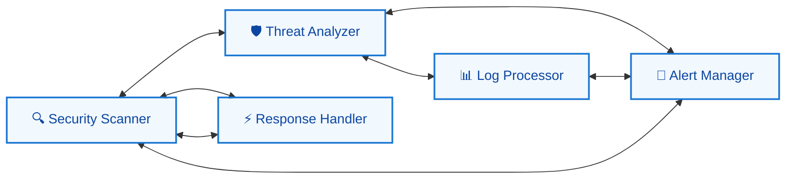
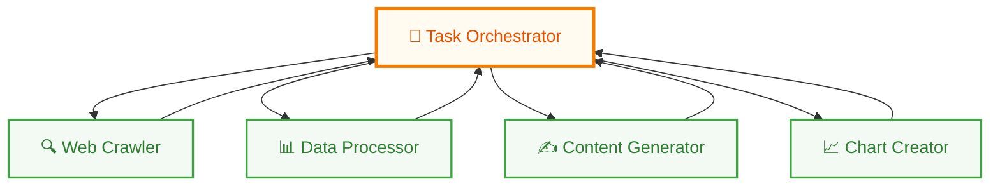
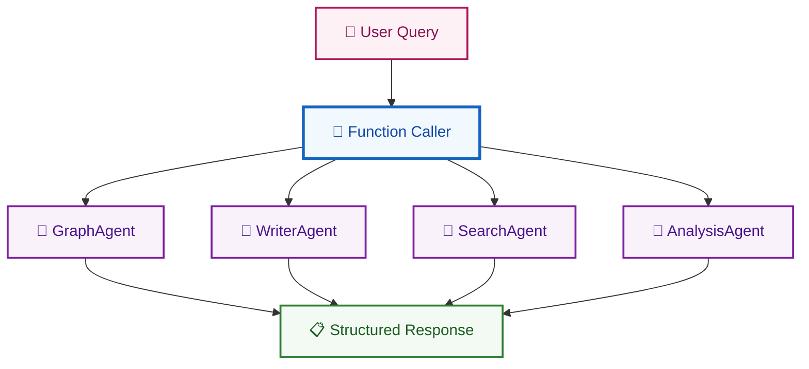
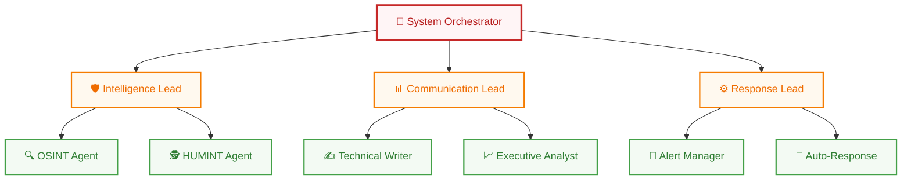
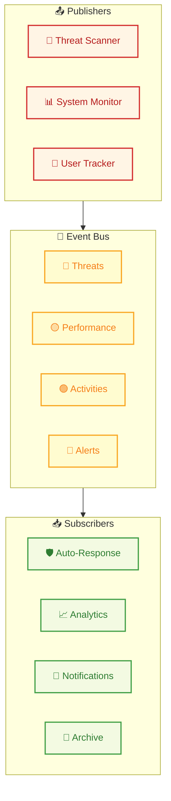

# 🤖 Multi-Agent Architecture Patterns

---

### 🎯 **Introduction**

Multi-agent systems represent a paradigm shift in distributed computing, where autonomous software entities collaborate to solve complex problems. The choice of architectural pattern significantly impacts system performance, scalability, maintainability, and fault tolerance.

### **Key Considerations**

- **🔄 Communication Patterns** — How agents exchange information
- **🎛️ Control Flow** — Decision-making and task distribution mechanisms  
- **⚡ Scalability** — System behavior under increased load
- **🛡️ Fault Tolerance** — Recovery mechanisms and redundancy
- **👁️ Observability** — Monitoring and debugging capabilities

---

## 🏗️ **Architecture Patterns**

---

### **1.** 🌐 **Peer-to-Peer Network**

> **Pattern Overview**  
> In the Peer-to-Peer (P2P) pattern, agents operate as equals in a decentralized network. Each agent can communicate directly with any other agent without requiring central coordination.



#### **📋 Real-World Implementation**
**🔐 Cybersecurity Threat Intelligence Network**
- **Scenario:** Distributed cybersecurity monitoring across multiple organizations
- **Agents:** Security scanners, threat analyzers, incident responders
- **Communication:** Direct peer-to-peer threat intelligence sharing
- **Scale:** 50-500+ participating organizations

#### **📊 Technical Specifications**

| **Metric** | **Value** | **Description** |
|------------|-----------|----------------|
| **⚡ Latency** | `10-50ms` | Direct communication overhead |
| **🚀 Throughput** | `High` | Parallel processing capability |
| **🛡️ Fault Tolerance** | `Excellent` | No single point of failure |
| **🔧 Complexity** | `Medium-High` | Coordination challenges |

#### **✅ Advantages**
- **🔄 High Redundancy** — Multiple communication paths ensure system resilience
- **📈 Scalability** — Linear scaling with network growth  
- **🎯 Autonomy** — Agents operate independently without central dependencies
- **⚖️ Load Distribution** — Natural load balancing across the network
- **⚡ Real-time Processing** — Immediate peer-to-peer information exchange

#### **❌ Limitations**
- **🤝 Coordination Complexity** — Achieving consensus becomes challenging
- **📢 Message Flooding** — Potential for exponential message growth
- **🔄 Inconsistent State** — Difficulty maintaining global system state
- **🔍 Discovery Overhead** — Finding and connecting to relevant peers
- **🔒 Security Concerns** — Harder to implement centralized security policies

#### **🛠️ Implementation Patterns**
```yaml
Communication Protocol: WebRTC, Message Queues, gRPC
Discovery Mechanism: DHT, Service Registry, Broadcast
State Management: CRDT, Gossip Protocols, Vector Clocks
```

---

### **2.** 👨‍💼 **Centralized Supervisor / Orchastrator Worker**

> **Pattern Overview**  
> The Centralized Supervisor pattern employs a single controlling agent that orchestrates all subordinate agents. This hierarchical approach provides clear command and control.



#### **📋 Real-World Implementation**
**🕵️ OSINT Intelligence Platform**
- **Scenario:** Open Source Intelligence gathering and analysis
- **Supervisor:** Central orchestrator managing investigation workflows
- **Workers:** Web scrapers, social media analyzers, report generators
- **Coordination:** Sequential and parallel task execution based on dependencies

#### **📊 Technical Specifications**

| **Metric** | **Value** | **Description** |
|------------|-----------|----------------|
| **⚡ Latency** | `20-100ms` | Central routing overhead |
| **🚀 Throughput** | `Medium` | Limited by supervisor capacity |
| **🛡️ Fault Tolerance** | `Low` | Single point of failure |
| **🔧 Complexity** | `Low` | Simple to understand and debug |

#### **✅ Advantages**
- **🎯 Simplified Coordination** — Single point of control reduces complexity
- **📋 Clear Accountability** — Easy to trace decisions and task assignments
- **👁️ Centralized Monitoring** — Complete visibility into system operations
- **⚡ Resource Optimization** — Efficient resource allocation and scheduling
- **📜 Policy Enforcement** — Consistent application of business rules

#### **❌ Limitations**
- **💥 Single Point of Failure** — Supervisor failure stops entire system
- **🚧 Bottleneck Risk** — All communication flows through supervisor
- **📈 Limited Scalability** — Supervisor capacity limits system growth
- **🤖 Reduced Autonomy** — Workers have limited decision-making capability
- **⏱️ Latency Overhead** — Additional hop for all inter-agent communication

#### **🎯 Best Use Cases**
- Small to medium-scale systems (10-50 agents)
- Well-defined, sequential workflows
- Systems requiring strict governance and compliance
- Prototyping and development environments

---

### **3.** 🛠️ **Tool-Calling Supervisor**

> **Pattern Overview**  
> This pattern treats subordinate agents as callable functions or tools, similar to how modern LLMs use function calling. The supervisor invokes agents with specific parameters.



#### **📋 Real-World Implementation**
**🤖 AI-Powered Research Assistant**
- **Scenario:** Academic research automation platform
- **Function Calls:** `search_papers()`, `summarize_content()`, `generate_citations()`
- **Integration:** OpenAI GPT-4 with custom function definitions
- **Output:** Structured research reports with citations and visualizations

#### **📊 Technical Specifications**

| **Metric** | **Value** | **Description** |
|------------|-----------|----------------|
| **⚡ Response Time** | `100-500ms` | Function call overhead |
| **🔧 Reliability** | `High` | Structured request/response |
| **🧪 Testability** | `Excellent` | Easy to mock and test |
| **🛠️ Maintainability** | `High` | Clear interfaces and contracts |

#### **✅ Advantages**
- **🧩 Modular Design** — Clear separation between orchestration and execution
- **🔒 Type Safety** — Structured parameters and return values
- **🧪 Easy Testing** — Individual tools can be tested in isolation
- **🤖 LLM Integration** — Natural fit for AI-powered systems
- **🔧 Composability** — Tools can be combined in flexible ways

#### **❌ Limitations**
- **🤖 Reduced Autonomy** — Tools cannot initiate communication
- **🔧 Static Interfaces** — Tool contracts must be predefined
- **⏭️ Sequential Execution** — Limited parallel processing capability
- **🔗 Tight Coupling** — Supervisor must understand all tool interfaces
- **📈 Scalability Limits** — Supervisor becomes bottleneck at scale

#### **🛠️ Implementation Example**
```yaml
Tool Definition:
  name: "analyze_sentiment"
  parameters:
    - text: string (required)
    - language: string (optional, default: "en")
    - confidence_threshold: float (optional, default: 0.8)
  returns:
    - sentiment: enum ["positive", "negative", "neutral"]
    - confidence: float [0.0-1.0]
    - reasoning: string
```

---

### **4.** 🌳 **Hierarchical Tree**

> **Pattern Overview**  
> The Hierarchical Tree pattern creates multiple layers of supervision, where supervisors manage subordinates that may themselves be supervisors.



#### **📋 Real-World Implementation**
**🏢 Enterprise Cybersecurity Operations Center (SOC)**
- **Root Level:** SOC Manager coordinating overall security posture
- **Mid Level:** Team leads for threat hunting, incident response, compliance
- **Leaf Level:** Specialized analysts, automated scanners, response tools
- **Scale:** 100-1000+ agents across multiple security domains

#### **📊 Technical Specifications**

| **Metric** | **Value** | **Description** |
|------------|-----------|----------------|
| **🌊 Depth Limit** | `3-5 levels` | Optimal organizational depth |
| **👥 Span of Control** | `3-7 subordinates` | Per supervisor capacity |
| **🛡️ Fault Recovery** | `Good` | Multiple supervision layers |
| **📈 Coordination Overhead** | `High` | Multi-level communication |

#### **✅ Advantages**
- **📈 Massive Scalability** — Can handle thousands of agents
- **🎯 Clear Command Structure** — Well-defined reporting relationships
- **🛡️ Fault Isolation** — Problems contained within organizational units
- **🎯 Specialized Management** — Domain-specific supervision at each level
- **⚖️ Load Distribution** — Work distributed across multiple supervisors

#### **❌ Limitations**
- **⏱️ Communication Latency** — Multiple hops increase response time
- **🔧 Complexity Overhead** — Difficult to design and maintain
- **🏢 Bureaucratic Delays** — Multi-level approval processes
- **💰 Resource Intensive** — Additional supervisor agents required
- **🐛 Debugging Challenges** — Complex trace paths through hierarchy

#### **🎯 Organizational Principles**
```yaml
Authority Flow: Top-down command distribution
Information Flow: Bottom-up status reporting
Decision Making: Distributed across appropriate levels
Exception Handling: Escalation to higher levels
```

---

### **5.** 🔀 **Custom/Hybrid**

> **Pattern Overview**  
> Custom/Hybrid patterns combine elements from multiple architectural approaches or create entirely new communication topologies tailored to specific domain requirements.

```mermaid
flowchart LR
    subgraph Input [" 📥 Data Ingestion "]
        S1[🔍 Web Scraper]
        S2[📊 API Client]
        S3[📁 File Processor]
    end
    
    subgraph Process [" ⚙️ Processing "]
        P1[🧹 Data Cleaner]
        P2[🔗 Entity Linker]
        P3[🤖 ML Analyzer]
    end
    
    subgraph Output [" 📤 Output "]
        O1[✍️ Report Writer]
        O2[📊 Dashboard]
        E1[🔍 Quality Control]
    end
    
    Input --> Process
    Process --> Output
    
    classDef ingestion fill:#e3f2fd80,stroke:#1976d2,stroke-width:2px,color:#0d47a1
    classDef processing fill:#fff3e080,stroke:#f57c00,stroke-width:2px,color:#ef6c00
    classDef output fill:#e8f5e880,stroke:#43a047,stroke-width:2px,color:#2e7d32
    
    class S1,S2,S3 ingestion
    class P1,P2,P3 processing
    class O1,O2,E1 output
```



#### **📋 Real-World Implementation**
**💰 Financial Risk Assessment Platform**
- **Ingestion:** Market data feeds, news sources, regulatory filings
- **Processing:** Risk calculations, stress testing, compliance checking
- **Output:** Risk reports, trading signals, regulatory submissions
- **Feedback:** Performance metrics, model accuracy, alert tuning

#### **📊 Technical Specifications**

| **Metric** | **Value** | **Description** |
|------------|-----------|----------------|
| **🎨 Customization** | `Very High` | Tailored to specific domain |
| **⚡ Performance** | `Excellent` | Optimized data flows |
| **🔄 Reusability** | `Low` | Domain-specific design |
| **🛠️ Maintenance** | `Complex` | Requires domain expertise |

#### **✅ Advantages**
- **⚡ Optimal Performance** — Streamlined for specific use cases
- **🎯 Domain Expertise** — Incorporates specialized knowledge
- **💰 Efficient Resource Usage** — Eliminates unnecessary communication
- **📜 Regulatory Compliance** — Can embed industry-specific requirements
- **🏆 Competitive Advantage** — Unique capabilities not easily replicated

#### **❌ Limitations**
- **🔄 Limited Reusability** — Difficult to adapt to other domains
- **💰 High Development Cost** — Requires extensive custom development
- **🛠️ Maintenance Complexity** — Specialized knowledge required for updates
- **🔗 Vendor Lock-in** — Tight coupling to specific technologies
- **🔄 Evolution Challenges** — Difficult to modify established patterns

#### **🎯 Design Considerations**
```yaml
Domain Analysis: Deep understanding of specific requirements
Performance Optimization: Custom routing and processing logic
Integration Points: APIs and data format specifications
Monitoring Strategy: Domain-specific metrics and alerts
```

---

### **6.** 📡 **Event-Driven (Pub/Sub)**

> **Pattern Overview**  
> The Event-Driven pattern uses an asynchronous messaging system where agents publish events to topics and subscribe to events they're interested in.



#### **📋 Real-World Implementation**
**⚡ Real-Time Cybersecurity Operations Platform**
- **Publishers:** Network scanners, endpoint agents, threat intelligence feeds
- **Topics:** Malware detected, suspicious traffic, policy violations
- **Subscribers:** SIEM systems, automated response tools, SOC dashboards
- **Scale:** Processing 1M+ events per second across 10,000+ endpoints

#### **📊 Technical Specifications**

| **Metric** | **Value** | **Description** |
|------------|-----------|----------------|
| **🚀 Throughput** | `Very High` | Parallel message processing |
| **⚡ Latency** | `1-10ms` | Near real-time event delivery |
| **📈 Scalability** | `Excellent` | Horizontal scaling capability |
| **🛡️ Fault Tolerance** | `High` | Message persistence and replay |

#### **✅ Advantages**
- **🔗 Loose Coupling** — Publishers and subscribers are independent
- **📈 High Scalability** — Easy to add new publishers and subscribers
- **🛡️ Fault Tolerance** — Message persistence ensures delivery
- **⚡ Real-Time Processing** — Near-instantaneous event propagation
- **🎯 Flexible Routing** — Complex event routing and filtering

#### **❌ Limitations**
- **🏗️ Infrastructure Complexity** — Requires robust messaging infrastructure
- **🔢 Message Ordering** — Challenges with ordered event processing
- **🐛 Debugging Difficulty** — Asynchronous flows are hard to trace
- **📊 Duplicate Messages** — Need for idempotent message handling
- **📊 Monitoring Overhead** — Complex observability requirements
